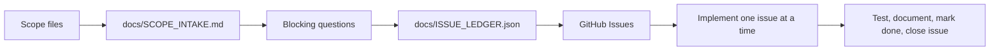

# Agentic Governance Starter Kit

[README](README.md) | [Scope Mapping](payload/docs/SCOPE_MAPPING.md) | [Scope Intake](payload/docs/SCOPE_INTAKE.md) | [Issue Governance](payload/docs/ISSUE_GOVERNANCE.md) | [Issue Ledger](payload/docs/ISSUE_LEDGER.json) | [Audit Report](payload/docs/ISSUE_LEDGER_AUDIT.md)

Portable package to install Governance-First Development in any repository.

> **Canonical authority:** this kit distributes governance semantics that are canonically defined in `b-repo/b-constitution`. It is a distribution mechanism, not an authority. See [Canonical Authority and Distribution Contract](#canonical-authority-and-distribution-contract).

## Contents

- [Canonical Authority and Distribution Contract](#canonical-authority-and-distribution-contract)
- [What This Kit Installs](#what-this-kit-installs)
- [Governance-First Development](#governance-first-development)
- [Scope-First Development](#scope-first-development)
- [Official Documentation First](#official-documentation-first)
- [Daily Starter Kit Update Check](#daily-starter-kit-update-check)
- [Quick Start](#quick-start)
- [Required Commands](#required-commands)
- [GitHub Requirements](#github-requirements)
- [Completion Gate](#completion-gate)

## Canonical Authority and Distribution Contract

### Canonical authority

The rules this kit distributes are defined **only** in `b-repo/b-constitution`:

- `constitution/repository-governance/008-issue-governance-and-agentic-delivery.md` — the single authority for issue governance semantics: governance model, required status values, ledger metadata, open-issue semantic minimum, quality score and weights, gate classes, GitHub synchronization contract, issue body contract, audit and CI gate, agentic delivery rules;
- `constitution/standards/007-distributed-definition-residency-standard.md` section 6 — the distribution-kit rule.

This kit does not own those semantics. Where the kit and the canonical document differ, the canonical document prevails and the kit is defective.

### Distribution rules this kit follows

1. **Identify the canonical source** of every rule the kit distributes. Sections in this kit's documents state the canonical authority and the baseline they were derived from.
2. **Distribute by reference, not by fork.** Payload adaptation is limited to paths, filenames and project metadata. Normative content is never modified, specialized or extended.
3. **State origin in installed files.** Files installed into a target repository identify the kit and the version they came from, plus the canonical authority of the semantics they carry.
4. **Consumers pin a version and do not vendor divergent copies.** A copy of the payload inside a consumer repository is permitted only as an identified build artefact of a stated kit version.
5. **Provide drift detection.** `scripts/governance/check_starter_kit_updates.py` is the kit's divergence check. Consuming repositories are expected to run it in CI so drift is detected rather than discovered at implementation time (Standard 007 section 6.5).

### What consumers must not conclude

- A kit-installed file is **not** an independent authority for issue governance, and it must not be cited as one in a repository that installs it.
- The kit does not create local policy. Statements such as the execution gate policy (`automatic agentic execution is blocked only when the gate is blocked`) are a **distribution of the canonical rule in `008`**, not a kit-local decision.

### Related guidance

- Kit maintenance guidance: [`docs/STARTER_KIT_DEVELOPER_GUIDANCE.md`](docs/STARTER_KIT_DEVELOPER_GUIDANCE.md);
- distributed issue-governance document: [`docs/ISSUE_GOVERNANCE.md`](docs/ISSUE_GOVERNANCE.md) and its payload counterpart.

## What This Kit Installs

- `AGENT_BOOTSTRAP_PROMPT.md`
- `docs/SCOPE_MAPPING.md`
- `docs/SCOPE_INTAKE.md`
- `docs/ISSUE_GOVERNANCE.md`
- `docs/ISSUE_LEDGER_AUDIT.md`
- `docs/ISSUE_LEDGER.json`
- `docs/OFFICIAL_DOCS_POLICY.md`
- `docs/STARTER_KIT_DEVELOPER_GUIDANCE.md`
- `scripts/governance/sync_issue_ledger.py`
- `scripts/governance/check_starter_kit_updates.py`
- `.github/workflows/issue-ledger-audit.yml`
- `.github/workflows/issue-ledger-sync.yml`
- `.github/ISSUE_TEMPLATE/`
- `.github/labels.yml`

## Governance-First Development

`docs/ISSUE_LEDGER.json` is the source of truth for governed work. It is not passive documentation. When a project contains the ledger, the repository must also contain the audit workflow, sync workflow, labels, issue templates, governance documentation, and sync script.

Work must enter the ledger before implementation. Do not open standalone GitHub Issues manually for governed project work. GitHub Issues are created or adopted by synchronization from `docs/ISSUE_LEDGER.json`.

Pull requests run audit only. Local validation and installation can run dry-run synchronization. Direct pushes to `main`, `master`, or `release/*` are not allowed. PR merges to protected branches run apply synchronization and then a health check that compares the ledger with GitHub Issues.

## Scope-First Development

When the user provides scope files, the first development task is scope mapping. The agent must inventory the supplied files in `docs/SCOPE_INTAKE.md`, ask blocking questions, and decompose the full known scope into governed issues before implementation starts.



## Official Documentation First

Every external integration, API, SDK, CLI, cloud service, OAuth flow, webhook, or vendor endpoint must be checked against the current official documentation before implementation or debugging. Agents must not rely only on model memory, old examples, community snippets, or previously known endpoints.

Installed projects receive `docs/OFFICIAL_DOCS_POLICY.md`, and integration issues should record the official documentation URL plus the endpoint, SDK method, scope, parameter, or behavior used.

## Daily Starter Kit Update Check

When a developer agent is active in a project, it must check for starter kit updates at most once per UTC day. The installed helper records checks in `.agents/starter-kit-last-check`:

```bash
python scripts/governance/check_starter_kit_updates.py
```

The installer also runs this helper before audit so projects get a visible update-check status during governance maintenance.

## Quick Start

From inside this kit folder:

1. Run installer in the current repository:
   - `bash install.sh`
2. Or target another path:
   - `bash install.sh --target /path/to/repo --project-name my-project`

The installer copies the governance payload, scope mapping documents, and `AGENT_BOOTSTRAP_PROMPT.md` into the target repository.

## Required Commands

- Audit and report:
  - `python scripts/governance/sync_issue_ledger.py --audit --report`
- Check starter kit updates:
  - `python scripts/governance/check_starter_kit_updates.py`
- Dry-run GitHub sync:
  - `python scripts/governance/sync_issue_ledger.py --repo owner/repo --dry-run`
- Apply GitHub sync:
  - `python scripts/governance/sync_issue_ledger.py --repo owner/repo --apply`
- Health check:
  - `python scripts/governance/sync_issue_ledger.py --repo owner/repo --health-check`

## GitHub Requirements

GitHub synchronization requires authenticated `gh`, `GH_TOKEN`, or `GITHUB_TOKEN`. The sync workflow uses `secrets.GITHUB_TOKEN` with `issues: write` and `contents: write` permissions.

Repositories should enforce branch protection or rulesets that require pull requests before merging and block direct pushes to `main`, `master`, and `release/*`.

If authentication is missing, apply and health-check fail clearly:

```text
GitHub authentication is not configured.
Cannot synchronize ISSUE_LEDGER.json with GitHub Issues.
```

## Completion Gate

A generated project is incomplete when `docs/ISSUE_LEDGER.json` exists and any governance automation is missing. Final validation must fail for missing audit workflow, missing sync workflow, missing labels, missing issue templates, missing GitHub token configuration, missing dry-run validation, missing apply validation, or governance drift.

The expected complete state is:

- Scope files are inventoried and mapped.
- Blocking scope questions are answered or explicitly recorded as assumptions.
- Every known scope item is represented by a ledger issue.
- Audit passes.
- Dry-run passes.
- Apply passes when credentials are available.
- Health check reports `governance_drift = 0`.
- Completed GitHub Issues are closed.
- Open GitHub Issues are either ledger-managed or intentionally backfilled/closed.
- Documentation is updated.
- Tests pass.

[README](README.md) | [Scope Mapping](payload/docs/SCOPE_MAPPING.md) | [Scope Intake](payload/docs/SCOPE_INTAKE.md) | [Issue Governance](payload/docs/ISSUE_GOVERNANCE.md) | [Issue Ledger](payload/docs/ISSUE_LEDGER.json) | [Audit Report](payload/docs/ISSUE_LEDGER_AUDIT.md)
