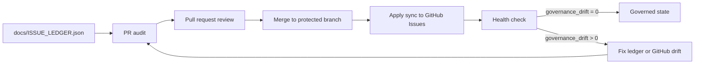

[README](../README.md) | [Issue Governance](ISSUE_GOVERNANCE.md) | [Issue Ledger](ISSUE_LEDGER.json) | [Audit Report](ISSUE_LEDGER_AUDIT.md)

# Issue Governance and Agentic Delivery

## Contents

- [Policy Summary](#policy-summary)
- [Required Files](#required-files)
- [Issue Ledger Source of Truth](#issue-ledger-source-of-truth)
- [Audit vs Apply](#audit-vs-apply)
- [Label Taxonomy](#label-taxonomy)
- [Branch and PR Policy](#branch-and-pr-policy)
- [Health Check](#health-check)
- [Governance Drift](#governance-drift)
- [Acceptance Gate](#acceptance-gate)
- [GitHub Token Requirements](#github-token-requirements)
- [Manual Recovery](#manual-recovery)

## Policy Summary

This repository uses Governance-First Development. `docs/ISSUE_LEDGER.json` is the canonical work ledger, and GitHub Issues are a synchronized execution surface.

- Issue sync to GitHub is mandatory when the ledger exists.
- Pull requests run audit only.
- Direct pushes to `main`, `master`, or `release/*` are not allowed.
- Merges to `main`, `master`, or `release/*` must come from pull requests and then run apply synchronization and health-check.
- Automatic agentic execution is blocked only when the issue gate is `blocked`.
- Open issues must include minimum semantic fields in `docs/ISSUE_LEDGER.json`.
- External integrations must be checked against current official documentation before implementation or debugging.
- Developer agents must check for starter kit updates once per UTC day while active.

## Required Files

When `docs/ISSUE_LEDGER.json` exists, these files are mandatory:

- `docs/ISSUE_GOVERNANCE.md`
- `docs/ISSUE_LEDGER_AUDIT.md`
- `docs/ISSUE_LEDGER.json`
- `docs/OFFICIAL_DOCS_POLICY.md`
- `docs/STARTER_KIT_DEVELOPER_GUIDANCE.md`
- `scripts/governance/sync_issue_ledger.py`
- `scripts/governance/check_starter_kit_updates.py`
- `.github/workflows/issue-ledger-audit.yml`
- `.github/workflows/issue-ledger-sync.yml`
- `.github/ISSUE_TEMPLATE/`
- `.github/labels.yml`

The audit command fails if any required file is missing.

## Issue Ledger Source of Truth

The ledger owns issue identity, title, status, labels, semantic scope, acceptance criteria, and GitHub linkage. GitHub Issues are created, updated, reopened, or closed from the ledger.

For governed work, the sequence is ledger first, sync second, implementation third:

1. Add or update the issue entry in `docs/ISSUE_LEDGER.json`.
2. Run audit and GitHub sync dry-run.
3. Apply sync so GitHub receives the canonical title, body, labels, and `ledger-id`.
4. Implement the change under that governed issue.
5. Mark it done only after evidence exists, then apply sync and health-check again.

Do not create standalone GitHub Issues manually for governed project work. If a GitHub Issue is created outside the ledger, backfill it into `docs/ISSUE_LEDGER.json` with `github.number`/`github.url`, run audit, dry-run, apply sync, and health-check.

`--apply` writes `github.number`, `github.url`, `github_number`, and `github_url` back to the ledger when GitHub issue links are discovered or created. This keeps future runs idempotent and auditable.

## Audit vs Apply

Audit validates the ledger and governance setup:

```bash
python scripts/governance/sync_issue_ledger.py --audit --report
```

Dry-run validates intended GitHub synchronization without writes:

```bash
python scripts/governance/sync_issue_ledger.py --repo owner/repo --dry-run
```

Apply publishes the ledger to GitHub Issues:

```bash
python scripts/governance/sync_issue_ledger.py --repo owner/repo --apply
```

Audit without apply is not sufficient after a merge to a protected branch.



## Label Taxonomy

Labels exist only when they help filter, route, or audit work in GitHub. The taxonomy intentionally avoids duplicate labels such as `phase` plus `phase:0`, because only `phase:0` is useful in the issue list.

Use this small set:

| Label family | Values | Why it exists | Practical use |
|---|---|---|---|
| `ledger-managed` | single marker | Separates generated/synchronized issues from manually opened issues. | Filter all governed issues. |
| `phase:*` | `phase:0`, `phase:1`, `phase:2`, `phase:3` | Groups work by delivery phase without verbose names. | Filter roadmap slices. |
| `type:*` | `type:feature`, `type:bug`, `type:architecture`, `type:technical-debt`, `type:documentation`, `type:governance`, `type:risk` | Shows the kind of work. | Route to the right reviewer or workflow. |
| `priority:*` | `priority:high`, `priority:medium`, `priority:low` | Keeps triage simple. | Sort what needs attention first. |
| `status:*` | `status:planned`, `status:in-progress`, `status:blocked`, `status:done` | Mirrors ledger status for GitHub filtering. | Detect status drift and blocked work. |
| `gate:*` | `gate:ready`, `gate:review`, `gate:blocked`, `gate:done` | Represents the agentic execution decision. | Decide whether an agent may execute automatically. |

Do not add labels unless they answer one of these questions:

- Do we need to filter by this in the issue list?
- Does this help route ownership or review?
- Does this help detect governance drift?
- Is it stable enough to be reused across projects?

The ledger may still contain rich fields such as scope, risks, dependencies, acceptance criteria, and evidence. Those fields belong in `docs/ISSUE_LEDGER.json` and the issue body, not necessarily in labels.

## Branch and PR Policy

All code and governance changes must be proposed from a named branch and merged through a pull request. Do not push directly to `main`, `master`, or `release/*`.

Recommended branch naming:

- `feature/<short-scope>`
- `fix/<short-scope>`
- `docs/<short-scope>`
- `governance/<short-scope>`
- `chore/<short-scope>`

Before pushing, rename local branches to match this convention:

```bash
git branch -m governance/issue-ledger-sync
```

This repository can detect direct pushes through the sync workflow, but true prevention must be configured with GitHub branch protection or repository rulesets:

- Require pull requests before merging.
- Require the issue ledger audit workflow.
- Require the issue ledger sync workflow on protected branches.
- Restrict direct pushes to protected branches.
- Require branch names to match the repository convention when using GitHub rulesets.

## Health Check

The health check compares `docs/ISSUE_LEDGER.json` with GitHub Issues:

```bash
python scripts/governance/sync_issue_ledger.py --repo owner/repo --health-check
```

It reports:

- `ledger_issues_count`
- `github_linked_issues_count`
- `missing_github_issues`
- `unmanaged_open_issues`
- `closed_mismatch`
- `status_mismatch`
- `label_mismatch`
- `governance_drift`

If `governance_drift > 0`, the command fails.

## Governance Drift

Governance drift means the ledger and GitHub Issues no longer describe the same governed work. Typical causes include manual edits in GitHub, missing issue creation, stale labels, or a completed ledger issue that remains open in GitHub.

Open GitHub Issues are considered unmanaged drift when they are not linked to the ledger and do not have the canonical generated shape:

- label `ledger-managed`;
- title beginning with `[ISSUE-ID]`;
- body marker `<!-- ledger-id: ISSUE-ID -->`;
- `github.number`/`github.url` recorded in `docs/ISSUE_LEDGER.json`.

The recovery path is to correct the ledger first, run audit, run dry-run, apply synchronization, and run health-check again.

## Acceptance Gate

A project is not complete when `docs/ISSUE_LEDGER.json` exists and GitHub synchronization is not configured.

Final validation must fail for:

- Governance drift greater than zero.
- Missing sync workflow.
- Missing audit workflow.
- Missing labels.
- Missing issue templates.
- Missing GitHub token configuration.
- Missing dry-run validation.
- Missing apply validation.

## GitHub Token Requirements

Apply and health-check require authenticated `gh`, `GH_TOKEN`, or `GITHUB_TOKEN`.

The workflow uses `secrets.GITHUB_TOKEN` with:

- `issues: write`
- `contents: write`

## Manual Recovery

1. Run `python scripts/governance/sync_issue_ledger.py --audit --report`.
2. Fix ledger schema, semantic fields, labels, or required files.
3. Backfill any unmanaged GitHub Issue into `docs/ISSUE_LEDGER.json` using `github.number` and `github.url`, or close it if it is not governed project work.
4. Run `python scripts/governance/sync_issue_ledger.py --repo owner/repo --dry-run`.
5. Run `python scripts/governance/sync_issue_ledger.py --repo owner/repo --apply`.
6. Run `python scripts/governance/sync_issue_ledger.py --repo owner/repo --health-check`.
7. Commit any ledger link updates produced by apply.

[README](../README.md) | [Issue Governance](ISSUE_GOVERNANCE.md) | [Issue Ledger](ISSUE_LEDGER.json) | [Audit Report](ISSUE_LEDGER_AUDIT.md)
