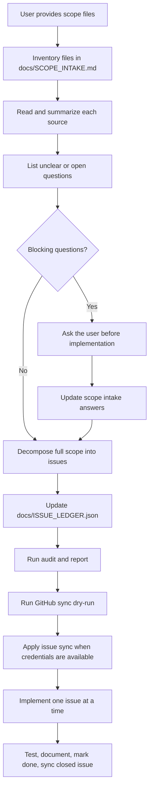

[README](../README.md) | [Scope Mapping](SCOPE_MAPPING.md) | [Scope Intake](SCOPE_INTAKE.md) | [Issue Governance](ISSUE_GOVERNANCE.md) | [Issue Ledger](ISSUE_LEDGER.json) | [Audit Report](ISSUE_LEDGER_AUDIT.md)

# Scope Mapping

## Contents

- [Purpose](#purpose)
- [Mandatory Order](#mandatory-order)
- [Scope File Intake](#scope-file-intake)
- [Open Questions](#open-questions)
- [Issue Decomposition](#issue-decomposition)
- [Execution Rules](#execution-rules)
- [Change Requests](#change-requests)
- [Completion Definition](#completion-definition)

## Purpose

Scope mapping is the first development activity after the user provides specification files, planning files, archives, screenshots, or other scope material.

The agent must not start implementation from raw scope files. The agent must first convert the whole understood scope into governed GitHub Issues through `docs/ISSUE_LEDGER.json`.

## Mandatory Order

## Scope File Intake

Every supplied scope file must be listed in `docs/SCOPE_INTAKE.md` with:

- File path or attachment name.
- File type.
- Short summary.
- Scope items found.
- Assumptions made.
- Questions raised.

Archives must be expanded or inspected before issue creation when the environment permits it. If an archive cannot be inspected, record the blocker and ask the user for the extracted content or permission to inspect it.

## Open Questions

The agent must ask questions before implementation when ambiguity affects:

- External integrations.
- Authentication or permissions.
- Data model or persistence.
- User workflow.
- Acceptance criteria.
- Security or compliance.
- Deployment environment.
- Test expectations.

Questions that do not block decomposition can be recorded as assumptions and converted into issue-level risks or follow-up issues.

## Issue Decomposition

Create as many issues as needed to cover the full scope. Prefer smaller executable issues over large umbrella issues.

Each issue must include:

- Problem statement.
- Scope in.
- Scope out.
- Target files.
- Implementation steps.
- Test plan.
- Success metrics.
- Dependencies.
- Acceptance criteria.
- Evidence expectations.

Do not leave scope only in planning documents. If it is work to be done, it must appear in `docs/ISSUE_LEDGER.json` and then in GitHub Issues.

## Execution Rules

Implementation starts only after:

- Scope files have been inventoried.
- Blocking questions have been answered or explicitly accepted as assumptions.
- The issue ledger covers the full known scope.
- Audit passes.
- GitHub sync dry-run passes.
- GitHub apply runs when credentials are available.
- Health-check reports zero governance drift.

During development, work one issue at a time:

1. Select the next issue whose gate is `ready` or `review`.
2. Create a named branch for that issue.
3. Implement only that issue's scope.
4. Run tests and update documentation.
5. Update evidence and status in the ledger.
6. Sync GitHub Issues.
7. Close the GitHub Issue only when implementation, tests, and documentation are complete.

## Change Requests

When the user asks for adjustments during development, do not silently mutate existing scope.

Use this rule:

- If the request changes already agreed scope, create a new issue.
- If the request clarifies an existing issue without changing outcome, update that issue and record the clarification.
- If the request invalidates existing work, create a replacement or remediation issue and link the dependency.

## Completion Definition

The project is complete only when:

- Every scope item is represented by a ledger issue.
- Every ledger issue is synchronized to GitHub.
- Every implemented issue has test evidence.
- Documentation is updated.
- `docs/ISSUE_LEDGER.json` marks completed work as `done`.
- GitHub Issues for completed work are closed.
- Health-check reports `governance_drift = 0`.

[README](../README.md) | [Scope Mapping](SCOPE_MAPPING.md) | [Scope Intake](SCOPE_INTAKE.md) | [Issue Governance](ISSUE_GOVERNANCE.md) | [Issue Ledger](ISSUE_LEDGER.json) | [Audit Report](ISSUE_LEDGER_AUDIT.md)
